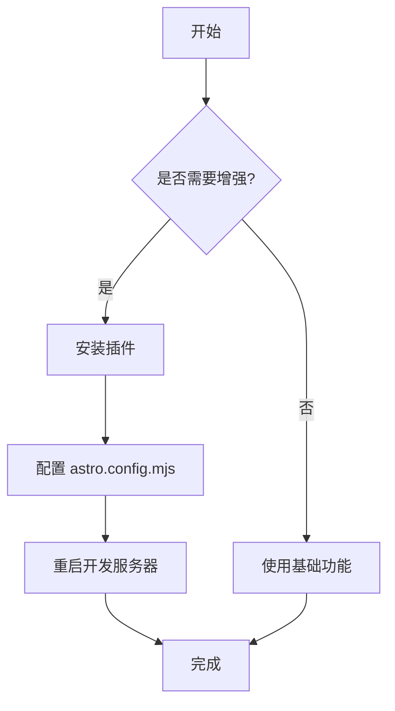
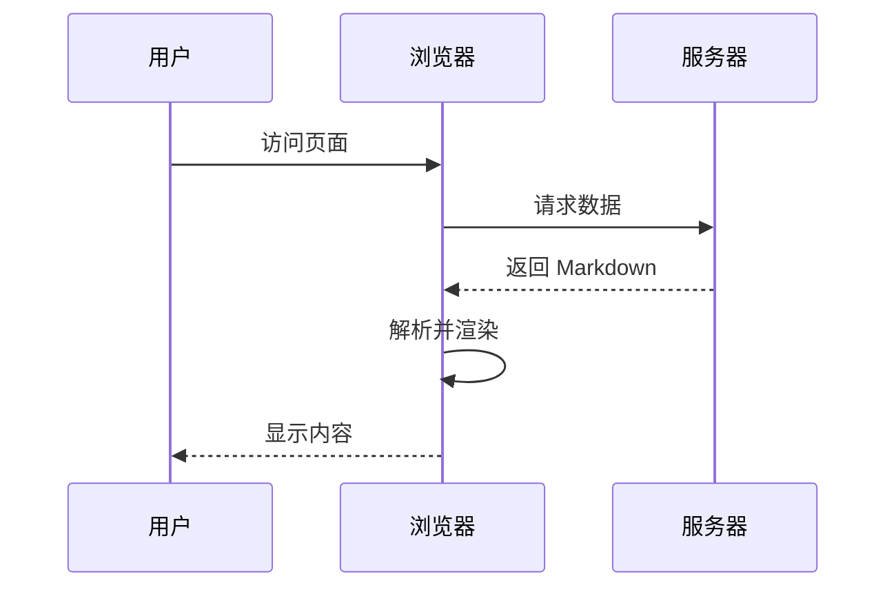

## 表格支持

使用 `remark-gfm` 插件，支持 GitHub Flavored Markdown 表格：

| 功能 | 插件 | 说明 |
|------|------|------|
| 表格 | remark-gfm | GitHub 风格表格 |
| Mermaid | remark-mermaid | 流程图、时序图等 |
| 数学公式 | remark-math + rehype-katex | LaTeX 数学公式 |
| 任务列表 | remark-gfm | 待办事项列表 |

## 任务列表

- [x] 安装 remark-gfm
- [x] 安装 remark-mermaid
- [x] 安装 remark-math 和 rehype-katex
- [ ] 测试所有功能
- [ ] 编写文档

## Mermaid 流程图



## Mermaid 时序图



## 数学公式

### 行内公式

这是一个行内公式：$E = mc^2$，爱因斯坦的质能方程。

### 块级公式

二次方程求根公式：

$$
x = \frac{-b \pm \sqrt{b^2 - 4ac}}{2a}
$$

傅里叶变换：

$$
F(\omega) = \int_{-\infty}^{\infty} f(t) e^{-i\omega t} dt
$$

矩阵表示：

$$
\begin{bmatrix}
a & b \\
c & d
\end{bmatrix}
\begin{bmatrix}
x \\
y
\end{bmatrix}
=
\begin{bmatrix}
ax + by \\
cx + dy
\end{bmatrix}
$$

## 删除线和强调

使用 `remark-gfm` 支持：

- ~~这是删除线~~
- **这是粗体**
- *这是斜体*
- ***这是粗斜体***

## 代码高亮

```typescript
interface User {
  id: number;
  name: string;
  email: string;
}

function greetUser(user: User): string {
  return `Hello, ${user.name}!`;
}
```

## 引用

> 这是一个引用块。
> 
> 可以包含多行内容。
> 
> > 甚至可以嵌套引用。

## 链接和图片

- [访问 Astro 官网](https://astro.build)
 

## 总结

通过这些插件，你的 Markdown 文档可以支持：

1. ✅ GitHub 风格表格
2. ✅ Mermaid 图表（流程图、时序图、甘特图等）
3. ✅ LaTeX 数学公式
4. ✅ 任务列表
5. ✅ 删除线
6. ✅ 自动标题锚点
7. ✅ 代码语法高亮
